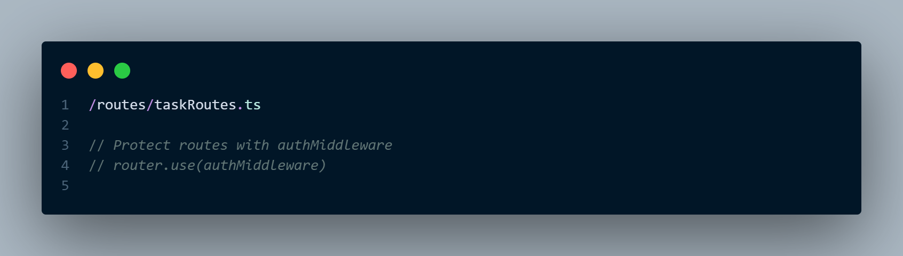

# API Documentation

> [!Note]
> Before testing API, please disable authMiddleware routes

> [!Note]
> View the API documentation generated by Swagger by go to [https://app.swaggerhub.com/apis/IJBAPTE/To_Do/1.0.0#/](https://app.swaggerhub.com/apis/IJBAPTE/To_Do/1.0.0#/)

View

## Screenshots

### 1. Fetch All Tasks

### 2. Get Single Task

### 3. Edit Task name and status/completion

### 3. Create New Task

### 5. Delete Task

